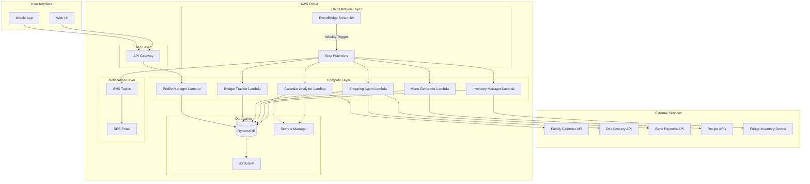

# Design Document: ThirdShift

## Overview

ThirdShift is a serverless, event-driven system deployed on AWS that automates household meal planning, inventory management, and grocery shopping for a family of four. The system runs on a weekly schedule, analyzing calendar availability, dietary profiles, food inventory, and expiration dates to generate optimized meal plans and autonomously execute grocery purchases through the Oda delivery service.

### Key Design Principles

- **Serverless Architecture**: Utilize AWS managed services to minimize operational overhead
- **Event-Driven**: Trigger workflows based on schedules and state changes
- **Modular Components**: Separate concerns for calendar, inventory, menu generation, and shopping
- **Security First**: Secure storage of credentials, PII, and payment information
- **Cost Optimization**: Minimize AWS costs through efficient resource usage and serverless pricing
- **Extensibility**: Design for future integration with additional grocery services and calendar providers

## Architecture

### High-Level Architecture Diagram



### Architecture Components

#### Orchestration Layer
- **EventBridge Scheduler**: Triggers the weekly planning cycle (configured for Sunday evening to ensure Monday morning delivery)
- **Step Functions**: Orchestrates the workflow with error handling, retries, and state management

#### Compute Layer (Lambda Functions)
- **Calendar Analyzer**: Retrieves and analyzes family calendar events, determines availability
- **Inventory Manager**: Syncs with fridge inventory, tracks expiration dates, updates stock levels
- **Menu Generator**: Creates meal plans based on constraints, retrieves recipes, optimizes for expiration dates
- **Shopping Agent**: Generates shopping lists using learned consumption patterns, places orders with Oda, processes payments
- **Profile Manager**: CRUD operations for family member and guest profiles
- **Consumption Learning**: Analyzes historical data to learn family habits and optimize quantities
- **Budget Tracker**: Monitors spending, enforces budget limits, generates reports

#### Data Layer
- **DynamoDB Tables**: Primary data store for profiles, inventory, meal plans, orders, and budget data
- **S3 Bucket**: Stores meal plan documents, recipes, and historical reports
- **Secrets Manager**: Securely stores API credentials for calendar, Oda, and bank integrations

#### API Layer
- **API Gateway**: REST API for the Profile Management UI and mobile app access

#### Notification Layer
- **SNS Topics**: Pub/sub for notifications (meal plan ready, order placed, budget alerts)
- **SES**: Email delivery for weekly meal plans and reports

## Components and Interfaces

### 1. Calendar Analyzer Component

**Purpose**: Retrieve calendar events and determine family member availability for each meal

**Inputs**:
- Date range (upcoming week)
- Family member profiles with calendar integration credentials

**Outputs**:
- Availability matrix (who is present for each meal)
- Special events requiring meal adjustments
- Cooking assignments (who is cooking when)

**AWS Services**:
- Lambda function (Node.js or Python)
- DynamoDB for caching calendar data
- Secrets Manager for calendar API credentials

**External Integrations**:
- Google Calendar API
- Microsoft Outlook Calendar API
- Apple Calendar (CalDAV)

**Logic**:
1. Authenticate with calendar service using stored credentials
2. Retrieve all events for the upcoming week
3. Parse events to identify meal times and family member availability
4. Detect special events (school trips, activities) requiring packed lunches
5. Identify cooking assignments from calendar entries
6. Store availability matrix in DynamoDB

### 2. Inventory Manager Component

**Purpose**: Track food inventory, expiration dates, and synchronize with physical fridge device

**Inputs**:
- Fridge inventory device data
- Meal plan (to update consumed items)
- Incoming grocery order (to add new items)

**Outputs**:
- Current inventory with quantities and expiration dates
- Items approaching expiration (within 3 days)
- Items to be prioritized in meal planning

**AWS Services**:
- Lambda function
- DynamoDB table for inventory
- IoT Core (if fridge device uses MQTT)

**External Integrations**:
- Smart fridge API or IoT device
- Barcode scanning integration

**Data Model**:
```json
{
  "itemId": "uuid",
  "name": "Milk",
  "category": "Dairy",
  "quantity": 2,
  "unit": "liters",
  "expirationDate": "2025-12-03",
  "location": "Fridge",
  "addedDate": "2025-11-25",
  "cost": 35.00
}
```

**Logic**:
1. Sync with fridge inventory device via API or IoT Core
2. Update inventory when groceries are delivered
3. Decrement quantities when items are used in meal plans
4. Flag items approaching expiration
5. Remove expired items and log waste events
6. Track consumption patterns for budget optimization

### 3. Profile Manager Component

**Purpose**: Manage family member and guest profiles with dietary restrictions and preferences

**Inputs**:
- User requests via API Gateway (CRUD operations)

**Outputs**:
- Profile data for meal planning
- Dietary constraints and preferences

**AWS Services**:
- Lambda function
- API Gateway (REST API)
- DynamoDB table for profiles
- Cognito for authentication

**Data Model**:
```json
{
  "profileId": "uuid",
  "type": "family_member | guest",
  "name": "John Doe",
  "age": 35,
  "role": "adult | child",
  "dietaryRestrictions": ["gluten-free", "lactose-intolerant"],
  "allergies": ["peanuts", "shellfish"],
  "dislikes": ["mushrooms", "olives"],
  "preferences": ["italian", "mexican"],
  "cookingExpertiseLevel": "intermediate",
  "calendarId": "calendar-integration-id",
  "visitDates": ["2025-12-01", "2025-12-02"]
}
```

**API Endpoints**:
- `POST /profiles` - Create profile
- `GET /profiles/{id}` - Get profile
- `PUT /profiles/{id}` - Update profile
- `DELETE /profiles/{id}` - Delete profile
- `GET /profiles` - List all profiles

### 4. Menu Generator Component

**Purpose**: Generate weekly meal plans with recipes based on all constraints

**Inputs**:
- Availability matrix from Calendar Analyzer
- Current inventory and expiring items
- Family member and guest profiles
- Budget constraints
- Historical consumption data

**Outputs**:
- Weekly meal plan (21 meals + 10 school lunches)
- Recipe links and instructions
- Ingredient requirements

**AWS Services**:
- Lambda function (may need higher memory/timeout for AI processing)
- DynamoDB for meal plans
- S3 for storing detailed meal plan documents
- Bedrock (optional: for AI-powered recipe generation)

**External Integrations**:
- Recipe APIs (Spoonacular, Edamam, TheMealDB)
- OpenAI API (optional: for custom recipe adaptation)

**Data Model**:
```json
{
  "mealPlanId": "uuid",
  "weekStartDate": "2025-12-02",
  "meals": [
    {
      "date": "2025-12-02",
      "mealType": "breakfast | lunch | dinner | school_lunch",
      "recipeName": "Scrambled Eggs with Toast",
      "recipeUrl": "https://...",
      "servings": 4,
      "cookingTime": 15,
      "difficulty": "beginner",
      "assignedCook": "profileId",
      "ingredients": [
        {"name": "eggs", "quantity": 8, "unit": "pieces"},
        {"name": "bread", "quantity": 8, "unit": "slices"}
      ],
      "nutritionInfo": {
        "calories": 350,
        "protein": 20,
        "carbs": 30,
        "fat": 15
      }
    }
  ],
  "totalCost": 1200.00,
  "status": "draft | approved | active"
}
```

**Logic**:
1. Retrieve all input data (availability, inventory, profiles, budget)
2. Identify constraints:
   - Dietary restrictions and allergies (hard constraints)
   - Expiring items (high priority)
   - Cooking expertise levels
   - Budget limits
   - School lunch requirements (5 days/week for 2 children)
3. Query recipe APIs with filters
4. Score recipes based on:
   - Uses expiring ingredients (+high score)
   - Matches preferences (+medium score)
   - Fits cook's expertise level (+medium score)
   - Within budget (+high score)
   - Nutritional balance (+low score)
5. Select recipes ensuring variety (no repeats within 2 weeks)
6. Generate school lunch menus (portable, child-friendly)
7. Calculate total ingredient requirements
8. Store meal plan in DynamoDB and detailed version in S3

### 5. Shopping Agent Component

**Purpose**: Generate shopping lists, place orders with Oda, and process payments

**Inputs**:
- Weekly meal plan with ingredient requirements
- Current inventory
- Budget constraints
- Oda account credentials
- Bank payment credentials

**Outputs**:
- Shopping list
- Order confirmation
- Updated inventory (expected items)
- Payment receipt

**AWS Services**:
- Lambda function
- DynamoDB for order history
- Secrets Manager for Oda and bank credentials
- SNS for order notifications

**External Integrations**:
- Oda API (grocery ordering)
- Bank API (payment processing)
- Vipps/payment gateway

**Data Model**:
```json
{
  "orderId": "uuid",
  "mealPlanId": "uuid",
  "orderDate": "2025-11-28",
  "deliveryDate": "2025-12-02",
  "deliveryTime": "08:00-10:00",
  "items": [
    {
      "productId": "oda-product-id",
      "name": "Eggs",
      "quantity": 2,
      "unit": "packages",
      "pricePerUnit": 45.00,
      "totalPrice": 90.00
    }
  ],
  "subtotal": 850.00,
  "deliveryFee": 49.00,
  "total": 899.00,
  "paymentStatus": "pending | completed | failed",
  "paymentTransactionId": "bank-transaction-id",
  "odaOrderId": "oda-order-confirmation-id"
}
```

**Logic**:
1. Calculate net ingredient requirements (meal plan - current inventory)
2. **Apply learned consumption patterns**:
   - Query ConsumptionPatterns table for each ingredient
   - Adjust quantities based on historical usage (if confidence > 0.7)
   - Add buffer for staple items based on weekly usage patterns
   - Account for number of people present (from availability data)
3. Map ingredients to Oda products using product search API
4. Build shopping cart with optimized quantities
5. Calculate estimated total cost
6. If cost exceeds budget:
   - Find cheaper alternatives for non-essential items
   - Reduce quantities where possible (respecting minimum learned usage)
   - Prioritize essential items (school lunches, dietary needs)
7. Place order with Oda API
8. Schedule delivery for Monday morning (08:00-10:00)
9. Process payment through bank integration
10. Store order confirmation with planned quantities
11. Update inventory with expected items
12. Send notification via SNS

### 6. Consumption Learning Component

**Purpose**: Analyze historical consumption data to learn family habits and optimize future planning

**Inputs**:
- Historical consumption data
- Waste events
- Actual vs planned usage

**Outputs**:
- Consumption patterns (average weekly usage per item)
- Portion size recommendations
- Waste reduction insights

**AWS Services**:
- Lambda function (scheduled weekly)
- DynamoDB for consumption history and patterns
- S3 for long-term historical data

**Data Model**:
```json
{
  "itemName": "Milk",
  "category": "Dairy",
  "averageWeeklyUsage": 3.5,
  "unit": "liters",
  "averageServingSize": 0.25,
  "wastePercentage": 5.0,
  "lastUpdated": "2025-11-28",
  "confidenceScore": 0.85,
  "dataPoints": 12,
  "trend": "stable | increasing | decreasing"
}
```

**Logic**:
1. Aggregate consumption data weekly
2. Calculate rolling averages (4-week, 12-week windows)
3. Identify consumption trends (increasing, decreasing, stable)
4. Detect seasonal patterns (holidays, summer vacation)
5. Calculate waste percentages per item
6. Adjust confidence scores based on data consistency
7. Update Shopping Agent with learned patterns
8. Provide recommendations for portion adjustments

**Learning Algorithm**:
- Use exponential moving average for recent trends
- Weight recent data more heavily (last 4 weeks = 60%, older = 40%)
- Require minimum 4 weeks of data before applying patterns
- Flag anomalies (e.g., vacation weeks) and exclude from averages
- Continuously refine as more data is collected

### 7. Budget Tracker Component

**Purpose**: Monitor spending, enforce budget limits, and generate financial reports

**Inputs**:
- Budget configuration (weekly/monthly limits)
- Order history
- Historical spending data

**Outputs**:
- Budget status (remaining budget)
- Spending reports
- Cost optimization recommendations
- Budget alerts

**AWS Services**:
- Lambda function
- DynamoDB for budget data and spending history
- S3 for monthly reports
- SNS for budget alerts
- QuickSight (optional: for visualization dashboards)

**Data Model**:
```json
{
  "budgetId": "uuid",
  "period": "weekly | monthly",
  "startDate": "2025-12-01",
  "endDate": "2025-12-31",
  "budgetLimit": 5000.00,
  "spent": 3200.00,
  "remaining": 1800.00,
  "orders": ["orderId1", "orderId2"],
  "alerts": [
    {
      "date": "2025-12-15",
      "type": "warning",
      "message": "80% of monthly budget used"
    }
  ]
}
```

**Logic**:
1. Track all grocery orders against budget
2. Calculate running totals (weekly, monthly)
3. Generate alerts when thresholds are reached (50%, 80%, 100%)
4. Provide cost optimization suggestions
5. Generate monthly reports with:
   - Total spending
   - Budget adherence percentage
   - Cost per meal
   - Waste reduction metrics
   - Comparison to previous periods

### 7. Step Functions Workflow

**Purpose**: Orchestrate the weekly planning cycle with error handling

**Workflow States**:
1. **Analyze Calendar** → Calendar Analyzer Lambda
2. **Check Inventory** → Inventory Manager Lambda
3. **Learn Patterns** → Consumption Learning Lambda (runs weekly to update patterns)
4. **Generate Menu** → Menu Generator Lambda
5. **Review Budget** → Budget Tracker Lambda (validate budget)
6. **Place Order** → Shopping Agent Lambda (uses learned patterns)
7. **Send Notification** → SNS publish
8. **Error Handler** → Retry logic or alert user

**Error Handling**:
- Retry failed steps up to 3 times with exponential backoff
- If Calendar API fails: use previous week's pattern as fallback
- If Oda API fails: send alert to user for manual intervention
- If payment fails: send urgent notification and halt workflow
- Log all errors to CloudWatch

**State Machine Definition** (simplified):
```json
{
  "StartAt": "AnalyzeCalendar",
  "States": {
    "AnalyzeCalendar": {
      "Type": "Task",
      "Resource": "arn:aws:lambda:...:function:CalendarAnalyzer",
      "Next": "CheckInventory",
      "Catch": [{"ErrorEquals": ["States.ALL"], "Next": "HandleError"}]
    },
    "CheckInventory": {
      "Type": "Task",
      "Resource": "arn:aws:lambda:...:function:InventoryManager",
      "Next": "GenerateMenu"
    },
    "GenerateMenu": {
      "Type": "Task",
      "Resource": "arn:aws:lambda:...:function:MenuGenerator",
      "Next": "ReviewBudget"
    },
    "ReviewBudget": {
      "Type": "Task",
      "Resource": "arn:aws:lambda:...:function:BudgetTracker",
      "Next": "PlaceOrder"
    },
    "PlaceOrder": {
      "Type": "Task",
      "Resource": "arn:aws:lambda:...:function:ShoppingAgent",
      "Next": "SendNotification"
    },
    "SendNotification": {
      "Type": "Task",
      "Resource": "arn:aws:states:::sns:publish",
      "End": true
    },
    "HandleError": {
      "Type": "Task",
      "Resource": "arn:aws:lambda:...:function:ErrorHandler",
      "End": true
    }
  }
}
```

## Data Models

### DynamoDB Table Design

#### Table 1: Profiles
- **Primary Key**: `profileId` (String)
- **Attributes**: name, type, age, role, dietaryRestrictions, allergies, dislikes, preferences, cookingExpertiseLevel, calendarId, visitDates
- **GSI**: `type-index` (for querying family members vs guests)

#### Table 2: Inventory
- **Primary Key**: `itemId` (String)
- **Sort Key**: `expirationDate` (String)
- **Attributes**: name, category, quantity, unit, location, addedDate, cost
- **GSI**: `expirationDate-index` (for querying items by expiration)

#### Table 3: MealPlans
- **Primary Key**: `mealPlanId` (String)
- **Sort Key**: `weekStartDate` (String)
- **Attributes**: meals (List), totalCost, status
- **GSI**: `weekStartDate-index` (for querying by date)

#### Table 4: Orders
- **Primary Key**: `orderId` (String)
- **Sort Key**: `orderDate` (String)
- **Attributes**: mealPlanId, deliveryDate, items, total, paymentStatus, odaOrderId
- **GSI**: `deliveryDate-index` (for querying upcoming deliveries)

#### Table 5: Budgets
- **Primary Key**: `budgetId` (String)
- **Sort Key**: `startDate` (String)
- **Attributes**: period, endDate, budgetLimit, spent, remaining, orders, alerts

#### Table 6: ConsumptionHistory
- **Primary Key**: `historyId` (String)
- **Sort Key**: `date` (String)
- **Attributes**: itemName, quantityUsed, mealPlanId, wasteAmount, actualServings
- **GSI**: `itemName-date-index` (for querying consumption patterns by item)
- **Purpose**: Track consumption patterns for optimization and learning

#### Table 7: ConsumptionPatterns
- **Primary Key**: `itemName` (String)
- **Attributes**: averageWeeklyUsage, averageServingSize, wastePercentage, lastUpdated, confidenceScore
- **Purpose**: Store learned patterns about family consumption habits

## Error Handling

### Error Categories and Responses

1. **External API Failures**
   - Calendar API: Use cached data or previous week's pattern
   - Recipe API: Fallback to local recipe database
   - Oda API: Alert user, provide manual ordering option
   - Bank API: Halt workflow, send urgent notification

2. **Data Validation Errors**
   - Invalid profile data: Return 400 error with details
   - Budget exceeded: Optimize shopping list or alert user
   - No recipes found: Relax constraints incrementally

3. **System Errors**
   - Lambda timeout: Increase timeout or split into smaller functions
   - DynamoDB throttling: Implement exponential backoff
   - Step Functions failure: Retry with exponential backoff (max 3 attempts)

4. **Business Logic Errors**
   - No availability data: Assume default family of 4 for all meals
   - Empty inventory: Generate full shopping list
   - Conflicting dietary restrictions: Prioritize allergies over preferences

### Monitoring and Alerting

- **CloudWatch Alarms**:
  - Lambda error rate > 5%
  - Step Functions execution failures
  - DynamoDB throttling events
  - API Gateway 5xx errors > 1%

- **SNS Notifications**:
  - Critical: Payment failures, order placement failures
  - Warning: Budget threshold exceeded, API degradation
  - Info: Weekly meal plan ready, order confirmed

## Testing Strategy

### Unit Testing
- Test each Lambda function independently with mocked dependencies
- Test data validation logic
- Test business logic (recipe scoring, budget optimization)
- Target: 80% code coverage

### Integration Testing
- Test Lambda functions with actual DynamoDB tables (test environment)
- Test external API integrations with sandbox/test accounts
- Test Step Functions workflow end-to-end
- Verify data flow between components

### End-to-End Testing
- Simulate complete weekly planning cycle
- Test with various scenarios:
  - Normal week with 4 family members
  - Week with guests
  - Week with special events
  - Week with budget constraints
  - Week with multiple dietary restrictions
- Verify order placement and payment processing (test mode)

### Security Testing
- Penetration testing on API Gateway endpoints
- Verify encryption at rest (DynamoDB, S3)
- Verify encryption in transit (TLS)
- Test IAM permissions (least privilege)
- Audit Secrets Manager access

### Performance Testing
- Load test API Gateway endpoints
- Test Lambda cold start times
- Test Step Functions execution time (target: < 5 minutes)
- Test DynamoDB read/write capacity

### User Acceptance Testing
- Test Profile Management UI with real users
- Verify meal plan quality and variety
- Validate school lunch appropriateness
- Confirm budget tracking accuracy
- Test notification delivery

## Security Considerations

### Authentication and Authorization
- **User Authentication**: AWS Cognito for web/mobile app users
- **API Authorization**: API Gateway with Cognito authorizer
- **Service-to-Service**: IAM roles with least privilege

### Data Protection
- **Encryption at Rest**: 
  - DynamoDB encryption enabled
  - S3 bucket encryption (SSE-S3 or SSE-KMS)
  - Secrets Manager automatic encryption
- **Encryption in Transit**: TLS 1.2+ for all API calls
- **PII Protection**: 
  - Encrypt sensitive profile data
  - Mask payment information in logs
  - Implement data retention policies

### Secrets Management
- Store all API credentials in AWS Secrets Manager
- Rotate secrets automatically (90-day rotation)
- Never log or expose secrets in code
- Use IAM roles for Lambda access to secrets

### Network Security
- Lambda functions in VPC (if accessing private resources)
- Security groups restricting outbound traffic
- API Gateway with WAF for DDoS protection
- Rate limiting on API endpoints

### Compliance
- GDPR compliance for personal data
- PCI DSS considerations for payment data (use tokenization)
- Data residency requirements (deploy in appropriate AWS region)

## Deployment Strategy

### Infrastructure as Code
- Use AWS CDK or Terraform for infrastructure provisioning
- Version control all infrastructure code
- Separate stacks for different environments (dev, staging, prod)

### CI/CD Pipeline
1. **Source**: GitHub/GitLab repository
2. **Build**: AWS CodeBuild
   - Run unit tests
   - Run linting and security scans
   - Build Lambda deployment packages
3. **Deploy**: AWS CodePipeline
   - Deploy to dev environment
   - Run integration tests
   - Deploy to staging (manual approval)
   - Run E2E tests
   - Deploy to production (manual approval)

### Environment Strategy
- **Development**: For active development, uses test APIs
- **Staging**: Production-like environment for final testing
- **Production**: Live environment with real integrations

### Rollback Strategy
- Use Lambda versioning and aliases
- Implement blue/green deployment for Step Functions
- Maintain previous version for quick rollback
- Monitor CloudWatch metrics post-deployment

## Cost Estimation

### Monthly AWS Costs (Estimated)

- **Lambda**: ~$20 (assuming 1000 invocations/month, 512MB memory)
- **DynamoDB**: ~$10 (on-demand pricing, low traffic)
- **S3**: ~$2 (minimal storage for meal plans and reports)
- **API Gateway**: ~$5 (REST API, low traffic)
- **Step Functions**: ~$5 (weekly executions)
- **Secrets Manager**: ~$2 (5 secrets)
- **SNS/SES**: ~$2 (notifications)
- **EventBridge**: ~$1 (scheduled rules)
- **CloudWatch**: ~$5 (logs and metrics)
- **Data Transfer**: ~$3

**Total Estimated Monthly Cost**: ~$55-60 USD

### Cost Optimization Strategies
- Use Lambda reserved concurrency for predictable workloads
- Implement DynamoDB auto-scaling
- Set S3 lifecycle policies for old reports
- Use CloudWatch Logs retention policies
- Monitor and optimize Lambda memory allocation

## Future Enhancements

1. **Multi-Grocery Store Support**: Integrate with additional grocery services beyond Oda
2. **Recipe Learning**: ML model to learn family preferences over time
3. **Leftover Management**: Track and suggest recipes using leftovers
4. **Meal Prep Mode**: Batch cooking suggestions for busy weeks
5. **Nutrition Tracking**: Detailed nutritional analysis and health goals
6. **Voice Integration**: Alexa/Google Home integration for meal queries
7. **Mobile App**: Native iOS/Android apps with push notifications
8. **Social Features**: Share recipes with friends, meal plan templates
9. **Sustainability Metrics**: Carbon footprint tracking for meals
10. **Smart Appliance Integration**: Connect with smart ovens, slow cookers

## Appendix

### Technology Stack Summary
- **Product Name**: ThirdShift
- **Compute**: AWS Lambda (Node.js 18.x or Python 3.11)
- **Orchestration**: AWS Step Functions, EventBridge
- **Storage**: DynamoDB, S3
- **API**: API Gateway (REST)
- **Security**: Cognito, Secrets Manager, IAM
- **Notifications**: SNS, SES
- **Monitoring**: CloudWatch, X-Ray
- **IaC**: AWS CDK (TypeScript) or Terraform

### External API Dependencies
- Calendar: Google Calendar API, Microsoft Graph API
- Recipes: Spoonacular API, Edamam API
- Grocery: Oda API (Norway)
- Payment: Vipps API or bank integration
- Fridge: Manufacturer-specific IoT API

### Development Timeline Estimate
- Phase 1: Core infrastructure and Profile Manager (2 weeks)
- Phase 2: Calendar and Inventory integration (2 weeks)
- Phase 3: Menu Generator (3 weeks)
- Phase 4: Shopping Agent and payment integration (2 weeks)
- Phase 5: Budget Tracker and reporting (1 week)
- Phase 6: Testing and refinement (2 weeks)
- **Total**: ~12 weeks for MVP
