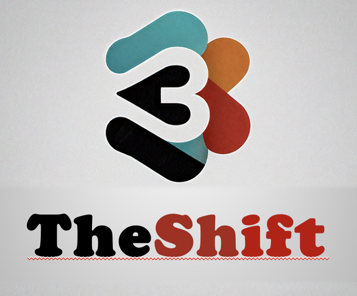
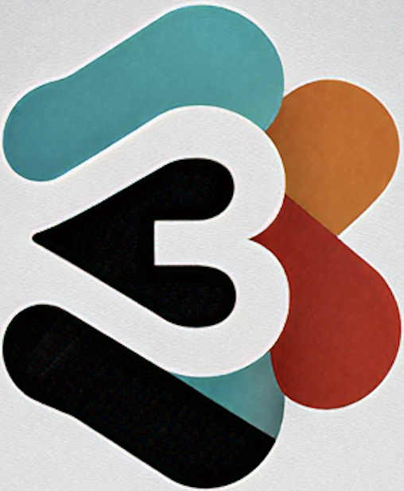

# ThirdShift Web Demo - Branding

## Logo Integration

The web demo now includes the ThirdShift brand logos for a professional look.

### Logo Files

Located in `web-demo/images/`:

1. **big_logo.png** - Full brand logo
   - Used in: Main header
   - Size: Max 400px width, responsive
   - Effect: Drop shadow for depth

2. **smal_logo.png** - Thumbnail/icon version
   - Used in: Browser favicon, meal plan calendar header
   - Size: 60x60px in calendar, 16x16px as favicon
   - Effect: Rounded corners, subtle shadow

### Where Logos Appear

#### 1. Main Header
```html

```
- Replaces the emoji-based title
- Centered at top of page
- Responsive sizing
- White/light background friendly

#### 2. Browser Tab (Favicon)
```html
<link rel="icon" type="image/png" href="images/smal_logo.png">
```
- Shows in browser tab
- Bookmarks
- Browser history

#### 3. Meal Plan Calendar
```html

```
- Small logo above "Weekly Meal Plan" heading
- Adds brand consistency
- 60x60px with rounded corners

## Styling

### Main Logo
```css
.main-logo {
    max-width: 400px;
    width: 100%;
    height: auto;
    margin-bottom: 20px;
    filter: drop-shadow(0 4px 6px rgba(0,0,0,0.2));
}
```

### Calendar Logo
```css
.calendar-logo {
    width: 60px;
    height: 60px;
    margin-bottom: 15px;
    border-radius: 12px;
    box-shadow: 0 2px 4px rgba(0,0,0,0.1);
}
```

## Visual Hierarchy

```
┌─────────────────────────────┐
│     [Big Logo]              │  ← Main brand identity
│  AI-Powered Meal Planning   │
│      Demo Dashboard          │
├─────────────────────────────┤
│   [Component Cards]          │
│   [Component Cards]          │
├─────────────────────────────┤
│   [Small Logo]               │  ← Brand reinforcement
│  📅 Weekly Meal Plan         │
│   [Calendar Grid]            │
└─────────────────────────────┘
```

## Responsive Design

- **Desktop**: Full logo at 400px width
- **Tablet**: Logo scales down proportionally
- **Mobile**: Logo maintains aspect ratio, max 100% width

## Brand Colors

The demo uses a gradient background that complements the logo:
```css
background: linear-gradient(135deg, #667eea 0%, #764ba2 100%);
```

## Testing

View the logos:
```bash
cd web-demo
python3 -m http.server 8080
# Open http://localhost:8080
```

You should see:
1. ✅ Big logo in header
2. ✅ Small logo in browser tab
3. ✅ Small logo in meal plan calendar (after generating menu)

## Future Enhancements

- [ ] Add logo animation on page load
- [ ] Use SVG versions for better scaling
- [ ] Add dark mode logo variants
- [ ] Include logo in email notifications
- [ ] Add logo to PDF meal plan exports

---

**Status**: ✅ Logos integrated  
**Date**: 2025-11-26  
**Files**: big_logo.png, smal_logo.png
